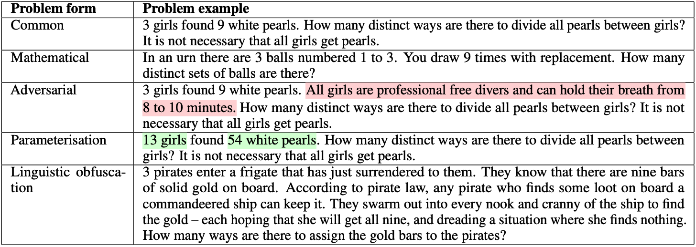

# Combi-Puzzles Dataset

[](https://arxiv.org/abs/2412.11908)
[](https://huggingface.co/datasets/andynik/combi-puzzles)

This repository contains the Combi-Puzzles dataset used in the research paper titled "Can Language Models Rival Mathematics Students? Evaluating Mathematical Reasoning through Textual Manipulation and Human Experiments."

## Abstract

In this study, we examine the ability of recent large language models (LLMs), including LLaMA-2, LLaMA-3.1, GPT-4, and Mixtral, in solving mathematical problems in combinatorics. We introduce the Combi-Puzzles dataset, consisting of 125 problem variants derived from 25 core combinatorial problems, to facilitate these comparisons. The dataset assesses the generalizability of LLMs and includes variations like adversarial, parameterization, and linguistic obfuscation to test models and humans alike. [Link to full paper]

## Dataset Description

The Combi-Puzzles dataset includes:
- **25 Base Combinatorial Problems**: Covers permutations, combinations, rules of addition/multiplication, and object arrangements.
- **5 Variations per Problem**:
  - **Common**: Standard textbook form.
  - **Mathematical**: Academic, technical presentation.
  - **Adversarial**: Includes additional irrelevant information.
  - **Parameterisation**: Altered numerical parameters.
  - **Linguistic Obfuscation**: Narrative fictional stories with problem context.

These variations are designed to thoroughly evaluate problem-solving strategies across different formats.

## Problem Example

```html

```



The image above illustrates an example of a combinatorial problem and its variations. The highlighted text indicates content modifications based on the common version. The mathematical and linguistic obfuscation variations constitute the new text

## Usage

You are encouraged to use this dataset to further evaluate problem-solving strategies in LLMs or other domains. Please cite our paper if you publish material based on this dataset.

## License

This dataset is licensed under the MIT License. See the `LICENSE` file for more details.

## Citation

Please cite the following if you use the dataset in your work:

```bibtex
@misc{nikolaiev2024languagemodelsrivalmathematics,
  title={Can Language Models Rival Mathematics Students? Evaluating Mathematical Reasoning through Textual Manipulation and Human Experiments},
  author={Andrii Nikolaiev and Yiannos Stathopoulos and Simone Teufel},
  year={2024},
  eprint={2412.11908},
  archivePrefix={arXiv},
  primaryClass={cs.CL},
  url={https://arxiv.org/abs/2412.11908},
}
```
